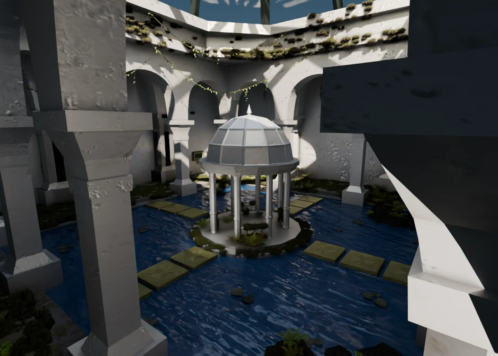

# MADNER — portfolio & flooded museum

[Visit the portfolio](https://portfolio-madner.vercel.app/) · [Enter the museum](https://portfolio-madner.vercel.app/museum)

I'm Flo Madner, a Creative Computing student in Austria. This is my portfolio: a straightforward page for browsing my work and CV, and a 3D museum where the same projects hang in picture frames.



## Why a museum?

I wanted the portfolio itself to bring together the things I work with: web development, games, visual design and 3D modelling. A museum gave the projects a physical place. You can walk up to a frame, read its plaque and open the project.

The environment is flooded and overgrown, with stone architecture, a central pavilion, vines and plants. Building it let me work on atmosphere as well as interaction. The black-and-white interface keeps the navigation simple around that detailed scene.

The regular page is just as important. Someone looking for a project, my background or my CV should be able to find it quickly. The museum is an optional way to explore the same work.

## How I built it

### 1. Model the space in Blender

I started with the architecture, floor levels, pavilion, frames and plaques, then added rocks, ferns, vines and other vegetation. I iterated on the scene's scale, raised the artwork to a comfortable viewing height and moved floating plants back onto their supporting surfaces.

The working source is `flooded-museum-15-refined.blend`. It stays separate from the generated browser version so the original scene remains editable.

### 2. Unwrap, texture and place the vegetation

I UV-unwrapped the geometry and built the materials, including weathered stone and normal maps. Plants use textured planes with alpha cutouts. I used a particle system to distribute the moss.

The moss needed extra work for the browser: its positions, rotations and proportions had to survive export, and submerged patches had to be removed. The final web model keeps 2,771 visible moss instances. The source plant stays in Blender for instancing, but its oversized standalone copy is excluded from the website.

### 3. Prepare a browser export

Blender node graphs do not all transfer directly to glTF. The export script creates a separate copy, repairs reversed architectural faces and bakes the procedural stone and rock colour into images.

This is a **colour bake using Cycles Emission**, with softened local ambient occlusion. It is **not a complete lighting bake**. The original normal maps keep their original UV layer; the baked colour uses a separate `UV_WebColor` layer. That separation preserves surface detail without stretching the colour atlas.

The export also writes collision geometry and records the project IDs, plaque/display roles and particle transforms needed by the website.

### 4. Optimize the assets

The Node optimization script compresses geometry with Meshopt, converts textures to WebP and removes unused objects and invisible moss. Repeated moss uses GPU instancing; repeated ferns and rocks are batched in the browser.

The current GLB is about **14.9 MB**, with a separate **1.5 MB collision file**. This is the download size, not the GPU memory requirement. The static page loads project previews, but does not download the GLB until the museum is opened.

### 5. Make the space interactive in Three.js

Three.js loads the model and supplies the browser lighting, reflective water, glass and material adjustments. Movement uses a player collider against the exported architecture and rocks. Foliage does not block the visitor.

Each frame has a stable ID connected to a project in `lib/data.ts`. The pictures fill the frame openings, and the labels follow the sloped plaques. Opening a frame shows the description, tools and project link.

I added mouse and keyboard controls, touch controls, a minimap, a pause menu, a reset position and lighter graphics. The gallery also lets visitors open projects without walking. If the model fails to load, the gallery remains available and the visitor can retry.

### 6. Connect it to the portfolio and deploy

The site uses Next.js, React and TypeScript. The home page opens the museum on demand; `/museum` is a direct entrance. **Back to portfolio** returns to the regular page from either entry.

Project content is shared between both views. The static page also includes my background, contact links and the original German CV. The site deploys to Vercel from this repository's `main` branch.

## Run it locally

You need **Node.js 22.18 or newer** and npm. Blender is only required if you want to edit and re-export the scene.

```sh
git clone https://github.com/derbreitesohn/Portfolio_Madner.git
cd Portfolio_Madner
npm ci
npm run dev
```

Open [localhost:3000](http://localhost:3000) for the portfolio or [localhost:3000/museum](http://localhost:3000/museum) for the museum. No environment variables or API keys are required.

In Windows PowerShell, use `npm.cmd` instead of `npm` if the execution policy blocks `npm.ps1`. After installing dependencies, `START-MUSEUM.cmd` is another way to start the local development server. Keep its window open while browsing locally.

To check a production build:

```sh
npm run build
npm run start
```

Run the development server or the production server on a given port, not both at once. Stop the current one with Ctrl+C first, or use `npm run start -- --port 3010`.

## Controls

| Action | Desktop | Touch |
| --- | --- | --- |
| Move | WASD or arrow keys | Thumbstick |
| Look around | Mouse after entering | Drag on the scene |
| Open a project | Click or E while aiming at a frame | Tap a frame or its prompt |
| Jump | Space | Jump button |
| Move faster | Shift | — |
| Pause / release the mouse | Esc | Pause button |
| Browse all projects | G or Gallery | Gallery button |
| Leave the museum | Back to portfolio in the header or pause menu | Same buttons |

## What to edit

| Change | File or folder |
| --- | --- |
| Project descriptions, links, dates and CV information | `lib/data.ts` |
| Map Blender frame IDs to projects | `lib/museum/projects.ts` |
| Home-page layout and museum entry | `app/page.tsx` |
| Static-page sections | `components/Hero.tsx`, `About.tsx`, `Projects.tsx`, `Experience.tsx`, `Footer.tsx` |
| Static-page appearance | `app/portfolio.css` |
| Museum menus, minimap and project dialogs | `components/museum/` |
| Loading, lighting and input | `lib/museum/engine.ts` |
| Artwork, water and material adjustments | `lib/museum/model.ts` |
| Floor normal-map scale and roughness | `lib/museum/floor.ts` |
| Walking and collision | `lib/museum/physics.ts` |
| Exported assets | `public/museum/` |
| Project screenshots | `public/projects/` |

### Replace the CV

1. Replace `public/cv/flo-madner-cv-de.pdf` with the new PDF.
2. Update its language, page count and revision date in `cvDocument` in `lib/data.ts`.
3. Update `cvData` when roles, dates or education change; the web text is not extracted from the PDF automatically.
4. Check **View CV** and **Download CV** in the Background section.

The current document is the original three-page German CV dated 18 August 2026. The small About portrait was extracted from that PDF. The PDF is a public website asset.

### Re-export after changing Blender

The authoring `.blend` and raw export are kept separately from Git. The repository already contains the optimized assets needed to run the website.

1. Save the authoring file. Keep the `EXPORT_Museum` collection and the names `Project_01_Frame/Plaque/Display` through `Project_06_Frame/Plaque/Display`, including their `project_id` and `role` properties.
2. The optimizer currently reads the preview from `../museum-preparation/v15/overview.png`. Restore that image from the project backup, or update the preview path in `scripts/optimize-museum.mjs` before running it.
3. From the repository, run Blender in the background. Adjust the executable, input and output paths to match your computer:

   ```powershell
   & 'C:\Program Files (x86)\Steam\steamapps\common\Blender\blender.exe' -b '..\flooded-museum-15-refined.blend' --python scripts\export-museum.py -- --out '..\museum-preparation\web\polished-export'
   npm.cmd run museum:optimize -- '..\museum-preparation\web\polished-export'
   ```

4. Run the checks below, then inspect the museum in the browser. Moving architecture requires regenerating collision as well as the model.
5. Commit the generated changes in `public/museum/` together.

The background export does not save over the authoring file or control the open Blender window. Do not run two exports into the same output directory simultaneously. See [the detailed Blender/export notes](3D_IMPLEMENTATION_PLAN.md) for bake caching, source files, material settings and asset validation.

## Checks

```sh
npm run lint
npm run test:museum
npm run test:museum:assets
npm run build
```

With a server running, check the actual browser flows:

```sh
npm run test:museum:browser
```

This checks movement, all six frames, pause/reset, project dialogs, simulated touch controls, loading failure recovery and return to the portfolio. It uses Microsoft Edge at the Windows installation path by default. Set `BROWSER_PATH` to an installed Chromium browser on another computer, and `MUSEUM_URL` if using another address or port. Screenshots and reports are written to the ignored `test-results/` folder.

The asset validator checks the GLB, decoded geometry, UV layers, project IDs, moss placement, plant grounding and the download budget. Touch emulation checks layout and controls; performance still needs testing on physical phones.

## Publish and save your work

Vercel is connected to this repository. After checking the changes, commit and push them to `main` using an account with write access. Wait for the Vercel deployment to succeed, then check the published portfolio, museum and CV links.

Keep both parts of the project:

- **Website:** this repository, including `public/`. A fresh clone plus `npm ci` restores the code and runtime assets.
- **Blender source:** the authoring `.blend`, its packed textures and any external source assets. Also keep the raw export and preview if you want to reproduce the optimization step without rebaking.

`node_modules`, `.next` and `test-results` are generated and do not need to be backed up. The deployed site runs on Vercel independently of the computer used to build it.

## Current tradeoffs

Browser lighting is real time, so it does not exactly match a Cycles render. Procedural rock bump is not fully baked, and some plant shading is approximated in Three.js. A dedicated indirect-light bake and testing on more physical mobile devices are useful next improvements. The paths have real gaps: jumping, wading and visiting a frame through the gallery are intentional ways to move around.
